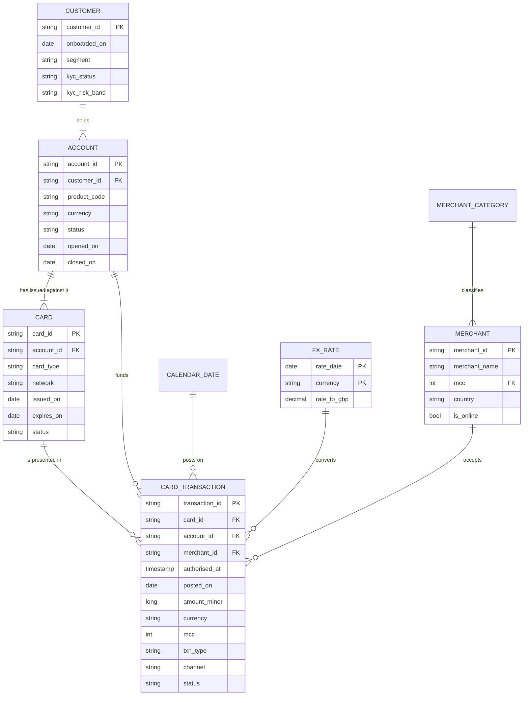

# Conceptual model

The conceptual model is deliberately written before any table exists. It names the things the
business talks about and the rules that hold between them, in language a product owner would use
and without a single decision about storage.

## Entities

| Entity | Definition | Identified by |
|---|---|---|
| **Customer** | A natural person who has completed onboarding and holds at least one product with the bank | `customer_id` |
| **Account** | A funding relationship between a customer and the bank, denominated in one currency | `account_id` |
| **Card** | A payment instrument issued against an account and presented at a merchant | `card_id` |
| **Merchant** | The counterparty accepting a card payment, as identified by the acquiring network | `merchant_id` |
| **Card Transaction** | One attempt to move money using a card. The grain of the business | `transaction_id` |
| **Merchant Category** | The ISO 18245 classification of what the merchant sells | `mcc` |
| **FX Rate** | The rate at which a non-GBP amount is expressed in GBP on a given date | `rate_date` + `currency` |
| **Calendar Date** | A day in the accounting calendar, with its week, month and UK bank holiday flags | `date_key` |

## Relationships

## Business rules the model has to enforce

These are the statements the business would defend in a meeting. Every one of them becomes either a
constraint, a data quality rule, or a documented exception, and the day-1 generator deliberately
violates a measured fraction of each so there is something for the rules to catch.

| # | Rule | Enforced as | Violating defect |
|---|---|---|---|
| BR-01 | Every card transaction belongs to a card that the bank has issued | Referential integrity | D03 |
| BR-02 | A purchase always names a merchant. Only ATM withdrawals and fees may omit one | Data quality rule | D01 |
| BR-03 | A purchase moves money away from the customer, so its amount is positive. Only a refund is negative | Data quality rule | D04 |
| BR-04 | `transaction_id` is unique across all time, not only within a day | Uniqueness | D02 |
| BR-05 | An MCC is a four digit ISO 18245 code | Validity | D05 |
| BR-06 | A transaction posts no more than two days after it was authorised | Timeliness SLO, not a hard rule | D06 |
| BR-07 | Amounts are held in minor units of their own currency, never in major units | Accuracy | D07 |
| BR-08 | An account with `status = open` has no `closed_on` | Consistency | D10 |
| BR-09 | A customer whose KYC status is `verified` has a verification timestamp | Completeness | D09 |
| BR-10 | Every transaction date has an FX rate for its currency, or inherits the most recent prior rate | As-of join, not a rule | D11 |

## What the conceptual model deliberately excludes

- **Balances.** This model covers money *moving*, not money *sitting*. Account balances come from
  the core banking ledger and are a separate business process; adding them here would blur the
  grain of the transaction fact.
- **Authorisation and clearing as separate events.** The processor feed in this project is already
  collapsed to one row per transaction. Modelling the auth-to-clearing lifecycle properly needs two
  facts and a matching process, which is on the roadmap rather than in this repo.
- **Disputes and chargebacks.** Real, but a different fact with a different grain.

Naming these is part of the deliverable. A model that does not say what it leaves out invites the
reader to assume it covers everything.
