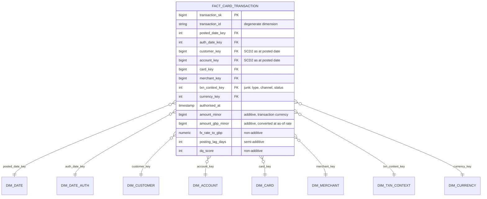

# Logical model, physical model, and the decisions in between

The conceptual model says what exists. This document takes it to third normal form, then denormalises
deliberately, and records why each denormalisation was worth it. The reason to write both down is
that a star schema on its own never shows what was given up to get it.

## Logical model, third normal form

```
customer(customer_id PK, onboarded_on, segment_code FK, kyc_status_code FK, kyc_risk_band_code FK,
         marketing_consent)
customer_contact(customer_id PK FK, email, phone, date_of_birth)          -- split for PII isolation
customer_address(customer_id FK, valid_from PK, valid_to, line1, line2, city, postcode, country)

account(account_id PK, customer_id FK, product_code FK, currency_code FK, status_code FK,
        opened_on, closed_on, overdraft_limit_minor)
card(card_id PK, account_id FK, card_type_code FK, network_code FK, issued_on, expires_on,
     status_code FK)

merchant(merchant_id PK, merchant_name, mcc FK, country_code FK, is_online, first_seen_on)
merchant_category(mcc PK, category_code FK, category_version)

card_transaction(transaction_id PK, card_id FK, account_id FK, merchant_id FK NULL,
                 authorised_at, posted_on, amount_minor, currency_code FK, mcc,
                 txn_type_code FK, channel_code FK, status_code FK, auth_code,
                 pos_entry_mode NULL, is_recurring NULL)

fx_rate(rate_date PK, currency_code PK FK, rate_to_gbp, source)
```

Three things in that listing are worth defending:

1. **`customer_contact` is a separate relation.** Not a normalisation requirement, a governance one.
   Every directly identifying attribute lives in one table, so masking, access control and an
   eventual erasure request all have a single target. Splitting it later costs a migration and a
   rewrite of every consumer.
2. **`card_transaction` carries both `card_id` and `account_id`.** This is a transitive dependency
   and strict 3NF would drop `account_id`, deriving it through the card. It stays because the
   funding account at the time of the transaction is a historical fact, and a card can be moved
   between accounts. Deriving it later would silently rewrite history.
3. **`mcc` is on the transaction as well as on the merchant.** Same reasoning. The processor sends
   the MCC it saw at the time. The merchant vendor reclassifies merchants. When they disagree, the
   transaction's own MCC is what the scheme settled on, and it is the one finance will defend.

## Physical model, the star



### Measures and their additivity

Stating this explicitly is the difference between a star schema and a trap.

| Measure | Additivity | Note |
|---|---|---|
| `amount_minor` | Additive **only within one currency** | Summing across currencies is meaningless and the marts do not expose it unfiltered |
| `amount_gbp_minor` | Fully additive | The one measure safe to sum anywhere. This is why it exists |
| `fx_rate_to_gbp` | Non-additive | Average it weighted by amount or not at all |
| `posting_lag_days` | Semi-additive | Averages, never sums |
| `dq_score` | Non-additive | Averages by rule dimension, never sums |

## Denormalisation decisions

| Decision | Cost | Why it wins |
|---|---|---|
| Junk dimension for `txn_type`, `channel`, `status` | One more join; a lookup nobody can read without the dimension | Removes three text columns from a fact that reaches hundreds of millions of rows. At bench scale this is the single largest driver of table width |
| `amount_gbp_minor` stored, not computed at query time | Storage, plus a restatement path if a rate is corrected | Every report converts. Computing it per query means the as-of FX join runs hundreds of times a day instead of once per row per load |
| `mcc` duplicated on fact and merchant dimension | Redundancy, and the two can disagree | They *should* be able to disagree. See the logical model note above |
| Two date keys on one fact | Two joins to `dim_date`, and a role-playing view for each | Finance and product genuinely need different dates. One date key would force one of them to be wrong |
| SCD2 keys resolved at load, not at query | A reload is needed if history is corrected | A query-time as-of join against SCD2 dimensions is the second most expensive thing in this schema after the fact scan itself |

## Partitioning and clustering plan

To be measured on day 5, not assumed:

- **Lake (Parquet)**: partition by `posted_date`. This matches the load pattern, the retention
  policy and the most common report filter. Hive-style directories, so a pruning engine can skip
  files without opening them.
- **Postgres serving marts**: range partition `fact_card_transaction` by month on `posted_date_key`,
  with a BRIN index on the partition key and a btree on `(customer_key, posted_date_key)` for the
  customer statement pattern.
- **Deliberately not clustered on `merchant_key`.** Merchant-led queries are analytical and belong
  on the lake side, where a column store makes the scan cheap. Adding a second clustering key to the
  serving layer would slow every write for a query pattern that has somewhere better to run.

That last row is the point of this whole document. The interesting modelling decisions are the ones
where the answer is "not here, over there", and they only become visible once you have written down
which store each access pattern belongs to.

## Access patterns, and where each one is meant to run

| # | Access pattern | Expected store | Why |
|---|---|---|---|
| 1 | Fetch one customer's full profile including nested KYC and address | Document store | One key, one deep document, no joins. A relational store has to reassemble it from four tables |
| 2 | One customer's 12 month spend by category | Postgres serving mart | Narrow, indexed, sub-second, serves the app |
| 3 | Spend by category and month across all customers | DuckDB over Parquet | Full scan of a few columns over hundreds of millions of rows. A column store wins by an order of magnitude |
| 4 | Top 20 merchants per segment with a window function | DuckDB over Parquet | Large intermediate result, no latency requirement |
| 5 | As-of FX join over the full history | DuckDB over Parquet, materialised back to Postgres | Range join, computed once at load rather than per query |

Day 5 runs all five against every store and publishes the numbers, including the cases where the
expectation in this table turns out to be wrong.
